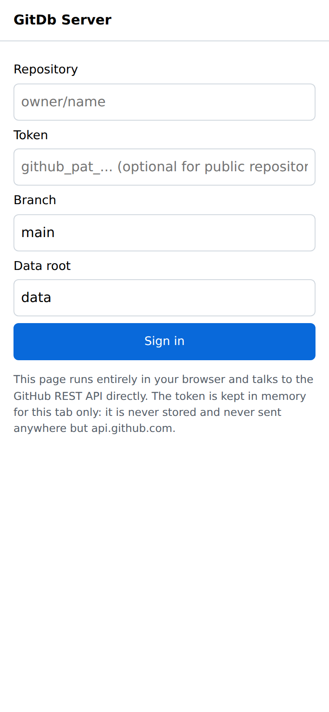
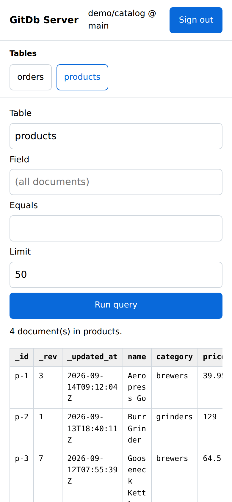
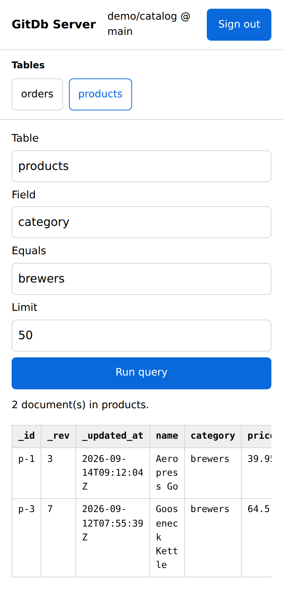

# GitDb Server

A small web UI for a GitDb repository: sign in with a repository and token,
browse the collections ("tables") it contains, and query them.

A backend-free build of this UI is published to GitHub Pages at
<https://charles2ke.github.io/GitDb/> (source in [`site/`](../../site/)); use it
if you just want to browse a repository. Run the FastAPI version below when you
want the HTTP API or want the token to stay on a server you control.

```bash
pip install -r examples/server/requirements.txt
uvicorn examples.server.main:app --reload
```

Then open <http://127.0.0.1:8000> and sign in with:


| Field | Meaning |
| --- | --- |
| Repository | `owner/name` of the backing repository. |
| Token | GitHub token with **Contents: Read** permission for that repository. |
| Branch | Branch to read, `main` by default. |
| Data root | Directory holding the collections, `data` by default. |

The sidebar lists every collection under the data root (the derived `_index`
and `_manifest` directories are hidden). Selecting one runs a query; the form
also filters by field value — indexed fields use the index, everything else
falls back to a client-side scan — and caps the number of returned documents.


The layout adapts to narrow screens: the sidebar turns into a row of table
chips, the query fields stack full width with touch-sized controls, and the
results table scrolls sideways.

<p>
  
  
  
</p>

The token is exchanged for an opaque, `HttpOnly` session cookie and is kept in
the server process memory only. Sessions are per process and are dropped on
sign-out or restart, so run the server locally next to the browser that uses it
rather than exposing it to a network. The repository, branch and data root are
remembered in the browser's `localStorage` and prefilled on the next visit; the
token never is.

While a request is in flight the button that started it is disabled, an empty
result explains itself instead of leaving a blank table, long cell values are
shown in full on hover, focus moves to the query form after sign-in, and status
messages sit in an `aria-live` region.

## HTTP API

| Endpoint | Description |
| --- | --- |
| `POST /api/login` | `{repo, token, branch, root}`, sets the session cookie. |
| `GET /api/collections` | Collection names for the signed-in session. |
| `POST /api/query` | `{collection, field, value, limit}` → documents and columns. |
| `POST /api/logout` | Closes the session. |
