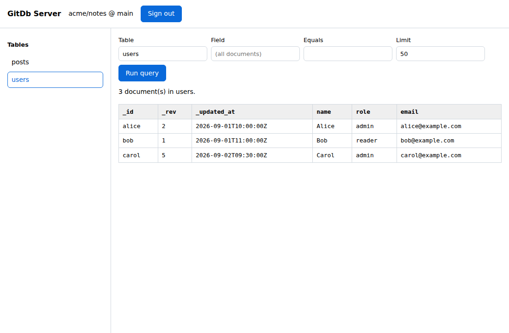

# GitDb Server on GitHub Pages

The static build of [GitDb Server](../examples/server/) published at
<https://charles2ke.github.io/GitDb/>. `index.html` is the whole site: no build
step, no dependencies and no backend.



The page is responsive, so the same build works on a phone: the table list
becomes a row of chips, the query fields stack full width with touch-sized
controls, and the results table scrolls sideways.

<p>
  
  
  
</p>

Because GitHub Pages only serves static files, this build does the work the
FastAPI example does server-side in the browser instead. It reads the same
repository layout through the GitHub REST API:

| Operation | Request |
| --- | --- |
| Collections | `GET /repos/{repo}/contents/{root}` — directories not starting with `_`. |
| Documents | `GET /repos/{repo}/contents/{root}/{collection}` — `*.json` files, walking shard directories. |
| Indexed filter | `GET /repos/{repo}/contents/{root}/_index/{collection}/{field}.json`. |
| Other filters | Client-side scan of the collection's documents. |

The token is held in a JavaScript variable for the lifetime of the tab: it is
never written to storage, never added to the URL, and only sent to
`api.github.com`. Reloading or signing out drops it. Public repositories work
without a token, subject to GitHub's unauthenticated rate limit.

Deployment is handled by [`.github/workflows/pages.yml`](../.github/workflows/pages.yml)
on every push to `main` that touches `site/`. Pages must be configured once with
the *GitHub Actions* source under **Settings → Pages**.

To try changes locally:

```bash
python -m http.server --directory site 8000
```
